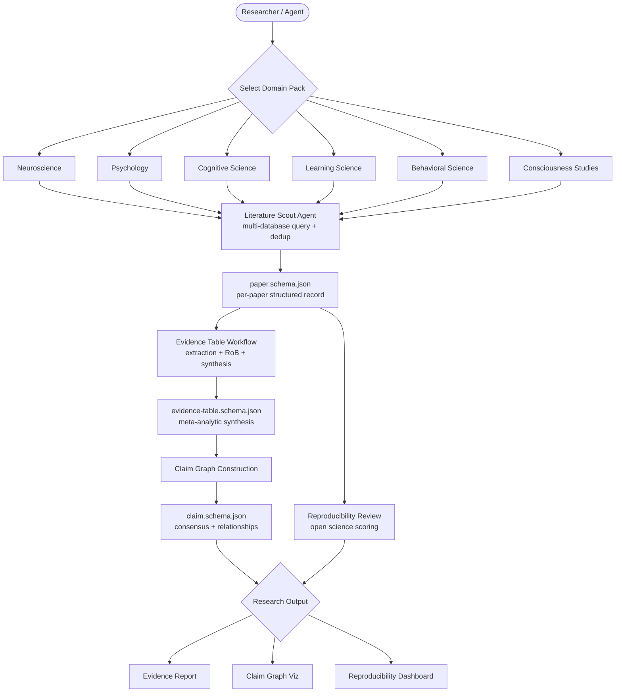

# Research Intelligence Systems

   

A portfolio of reusable domain packs, agent workflows, and JSON schemas for building AI-assisted research intelligence systems across scientific disciplines. Part of the [mind-intelligence-swarm](../README.md) ecosystem.

**The problem:** Scientific literature review is slow, fragmented, and inconsistently rigorous. A thorough systematic review takes 6–18 months. Evidence quality varies wildly. Open science compliance is hard to track. Researchers reinvent the wheel for each domain.

**The solution:** Six curated domain packs, each encoding the best practices, ontologies, agent workflows, and data standards of a scientific discipline — ready to plug into automated research intelligence pipelines.

---

## Domain Packs

| Pack | Core Disciplines | Key Standards | Status |
|---|---|---|---|
| [neuroscience](packs/neuroscience/) | Cognitive, systems, computational, clinical | BIDS, NWB, COBIDAS, fMRIPrep | ✅ Active |
| [psychology](packs/psychology/) | Cognitive, social, clinical, developmental, I/O | OSF preregistration, Registered Reports, CONSORT | ✅ Active |
| [learning-science](packs/learning-science/) | Cognitive science of learning, ed. psychology, AIED | xAPI, PSLC DataShop, WWC evidence tiers, IES standards | ✅ Active |
| [cognitive-science](packs/cognitive-science/) | Reasoning, language, memory, perception, computation | Cognitive Atlas, ACT-R, Bayesian cognitive models | ✅ Active |
| [behavioral-science](packs/behavioral-science/) | Behavioral economics, health behavior, nudge, decision | BCTTv1, COM-B, EAST, CONSORT, PAP standards | ✅ Active |
| [consciousness-studies](packs/consciousness-studies/) | NCC, phenomenology, DoC, altered states | COGITATE protocol, PCI, CRS-R, adversarial collab | ✅ Active |

---

## Architecture



---

## Workflows

| Workflow | Description | Primary Input | Primary Output |
|---|---|---|---|
| [literature-review](workflows/literature-review.md) | Multi-database discovery, PRISMA screening, claim extraction | Research question (PICO/PECO) | evidence-table + claim graph |
| [evidence-table](workflows/evidence-table.md) | Two-pass extraction, RoB scoring, meta-analysis, GRADE | Screened paper set | evidence-table.schema.json |
| [reproducibility-review](workflows/reproducibility-review.md) | Open science scoring, statistical red flags, replication status | Paper set | reproducibility-score.json per paper |
| [preregistration](workflows/preregistration.md) | OSF/AsPredicted registration, Registered Reports, power analysis | Study description | Registration document + power report |

---

## Schemas

| Schema | Purpose | Key Fields |
|---|---|---|
| [paper.schema.json](schemas/paper.schema.json) | Structured paper record | DOI, authors, effect size, preregistered, open_data, data_standard, claims |
| [claim.schema.json](schemas/claim.schema.json) | Individual empirical claim with evidence metadata | claim_text, consensus_level, replication_success_rate, moderators, claim graph edges |
| [evidence-table.schema.json](schemas/evidence-table.schema.json) | Systematic evidence table with synthesis statistics | entries[], pooled_effect_size, heterogeneity_i2, grade_certainty, PRISMA counts |

---

## Agent Exploration

Every workflow has agent entry points. The system is designed for autonomous agent use with human oversight at key decision points.

### Quick Start (3 Steps)

```
1. Pick a domain pack:     packs/neuroscience/README.md
                           → domain scope, data standards, ontologies

2. Run a workflow:         workflows/literature-review.md
                           → structured 8-step process with agent support table

3. Ingest to schema:       schemas/paper.schema.json
                           → validate: npx ajv validate -s schemas/paper.schema.json -d paper.json
```

### Core Agents

| Agent | Description |
|---|---|
| `literature-scout` | Multi-database paper discovery (PubMed, PsycINFO, ERIC, Semantic Scholar, OpenAlex) with domain-specific filters and citation chaining |
| `effect-size-extractor` | Pulls Cohen's d, r, η², OR, RR from full text and statistical tables; converts between formats |
| `bias-assessor` | Applies Cochrane RoB 2.0, ROBINS-I, Newcastle-Ottawa, or QUADAS-2 based on study design |
| `reproducibility-assessor` | Scores open science compliance: preregistration (25 pts), open data (20 pts), open code (20 pts), methods reporting (20 pts), replication status (15 pts) |
| `claim-mapper` | Extracts empirical claims from papers; builds claim graph with `supports`, `contradicts`, `refines` edges; assigns `consensus_level` |
| `preregistration-drafter` | Generates OSF-compatible registration document and AsPredicted form from study description |
| `evidence-synthesizer` | Meta-analytic pooling (REML random effects), I² heterogeneity, Egger's test, PET-PEESE publication bias correction |
| `deviation-tracker` | Compares final paper methods against preregistration to flag undisclosed deviations |
| `grade-assessor` | Rates GRADE certainty domains (RoB, inconsistency, indirectness, imprecision, publication bias) and outputs high/moderate/low/very-low |

### Agent Exploration Example

Starting from scratch with a research question:

```
Question: "Does retrieval practice improve long-term retention compared to re-reading?"

1. literature-scout (learning-science pack)
   → 847 papers found, 312 after dedup
   → ERIC + PsycINFO + Google Scholar

2. screening → 47 included (PRISMA: 847→312→84→47)

3. effect-size-extractor
   → d = 0.50 (SD = 0.28) across 47 studies

4. bias-assessor (RoB2 for RCTs, Newcastle-Ottawa for observational)
   → 22 low RoB, 18 some-concerns, 7 high

5. evidence-synthesizer
   → pooled d = 0.50 [0.43, 0.57], I² = 61%
   → Egger's: no asymmetry (p = .21)

6. grade-assessor
   → Certainty: MODERATE (downgraded for inconsistency)

7. claim-mapper
   → claim: "Retrieval practice produces superior long-term retention vs re-reading"
   → consensus_level: established (replication_success_rate = 0.84, n=31 replications)
```

---

## Open Science Standards Supported

| Standard | Domain | What It Provides |
|---|---|---|
| **BIDS** (Brain Imaging Data Structure) | Neuroscience | Standardized directory structure for MRI, EEG, MEG, ieEEG datasets |
| **NWB** (Neurodata Without Borders) | Neuroscience | HDF5 format for electrophysiology, calcium imaging, behavioral data |
| **xAPI / Tin Can** | Learning science | JSON-LD event format for learning interactions stored in LRS |
| **OSF Preregistration** | All domains | Timestamped pre-data-collection study registration |
| **Registered Reports** | All domains | Peer review before results; IPA removes publication bias |
| **COBIDAS** | Neuroscience | Comprehensive checklist for MRI, fMRI, EEG, MEG reporting |
| **CONSORT 2010** | Psychology, behavioral, clinical | RCT reporting standard (25-item checklist + flow diagram) |
| **STROBE** | Behavioral, epidemiology | Observational study reporting (22-item checklist) |
| **PRISMA 2020** | All domains (meta-analysis) | Systematic review reporting (27-item checklist + flow) |
| **TIDieR** | Behavioral, clinical | Intervention description and replication (12-item checklist) |
| **BCT Taxonomy v1** | Behavioral science | 93 behavior change techniques in 16 clusters |
| **GRADE** | All domains | Evidence certainty framework: high → moderate → low → very-low |

---

## What You Can Build With This

1. **Lab literature review agent** — Feed a domain pack + research question into the literature-review workflow to produce a structured evidence table in hours rather than months
2. **Systematic review assistant** — PRISMA-compliant, GRADE-rated synthesis with automated risk-of-bias scoring
3. **Research credibility dashboard** — Reproducibility scores across a body of literature; identify low-confidence findings before building on them
4. **Grant proposal evidence map** — Claim graph showing what's established (green), emerging (yellow), and contested (red) in a research area
5. **Graduate student onboarding tool** — Curated reading list, key constructs, data standards, and agent workflows for any of the six disciplines
6. **Replication priority queue** — Identify claims with low `replication_success_rate` and high `sample_size` that would benefit most from replication
7. **Cross-disciplinary discovery** — Overlap queries across cognitive-science + neuroscience packs to surface bridging literature
8. **Preregistration assistant** — Auto-draft OSF registration documents and power analyses from study design notes, reducing preregistration friction

---

## Quick Start

```bash
# Clone the repo
git clone https://github.com/frankxai/research-intelligence-systems
cd research-intelligence-systems

# Explore a domain pack
cat packs/neuroscience/README.md       # BIDS, NWB, COBIDAS, agent workflows

# Run a workflow
cat workflows/literature-review.md    # 8-step PRISMA-aligned literature review

# Validate a paper record against the schema
npx ajv validate -s schemas/paper.schema.json -d my-paper.json

# Validate a claim record
npx ajv validate -s schemas/claim.schema.json -d my-claim.json
```

---

## Repository Structure

```
research-intelligence-systems/
├── packs/
│   ├── neuroscience/
│   │   └── README.md          # BIDS, NWB, COBIDAS, neuro agent workflows
│   ├── psychology/
│   │   └── README.md          # constructs, RoB tools, Registered Reports
│   ├── learning-science/
│   │   └── README.md          # xAPI, WWC evidence tiers, multilevel modeling
│   ├── cognitive-science/
│   │   └── README.md          # Bayesian cognitive models, Cognitive Atlas, ACT-R
│   ├── behavioral-science/
│   │   └── README.md          # BCTTv1, COM-B, field experiments, causal inference
│   └── consciousness-studies/
│       └── README.md          # IIT/GNWT/RPT theories, PCI, DoC standards, COGITATE
├── workflows/
│   ├── literature-review.md   # 8-step PRISMA-aligned discovery and synthesis
│   ├── evidence-table.md      # Two-pass extraction + GRADE certainty
│   ├── reproducibility-review.md  # Open science scoring + statistical red flags
│   └── preregistration.md    # OSF/AsPredicted + Registered Reports pipeline
├── schemas/
│   ├── paper.schema.json      # Comprehensive paper record (50+ fields)
│   ├── claim.schema.json      # Empirical claim with replication graph
│   └── evidence-table.schema.json  # Systematic evidence table with GRADE
├── EXPERIENCE.md              # Researcher and agent UX flows
├── researchpack.yaml          # Pack registry and dependency manifest
└── README.md                  # This file
```

---

## Related Repositories

| Repo | Role |
|---|---|
| [mind-intelligence-swarm](../README.md) | Parent ecosystem — orchestration and multi-domain coordination |
| [research-intelligence-os](https://github.com/frankxai/research-intelligence-os) | Runtime layer — agent execution, pipeline orchestration |
| [neuroscience-research-intelligence-system](https://github.com/frankxai/neuroscience-research-intelligence-system) | Full neuroscience implementation |
| [psychology-research-intelligence-system](https://github.com/frankxai/psychology-research-intelligence-system) | Full psychology implementation |

---

*Part of the [FrankX](https://frankx.ai) mind-intelligence-swarm ecosystem.*
